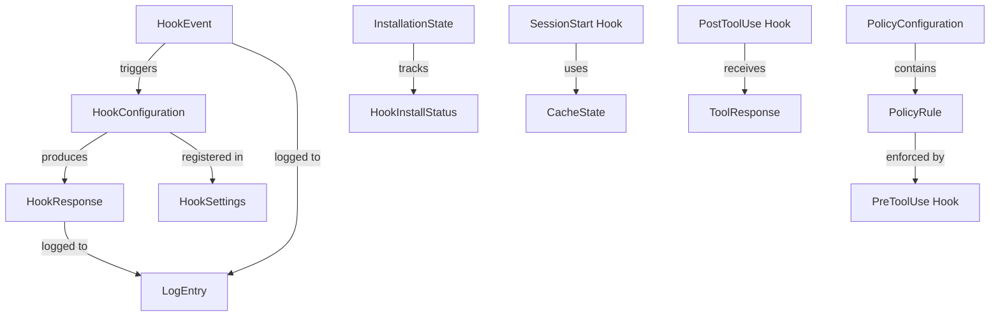
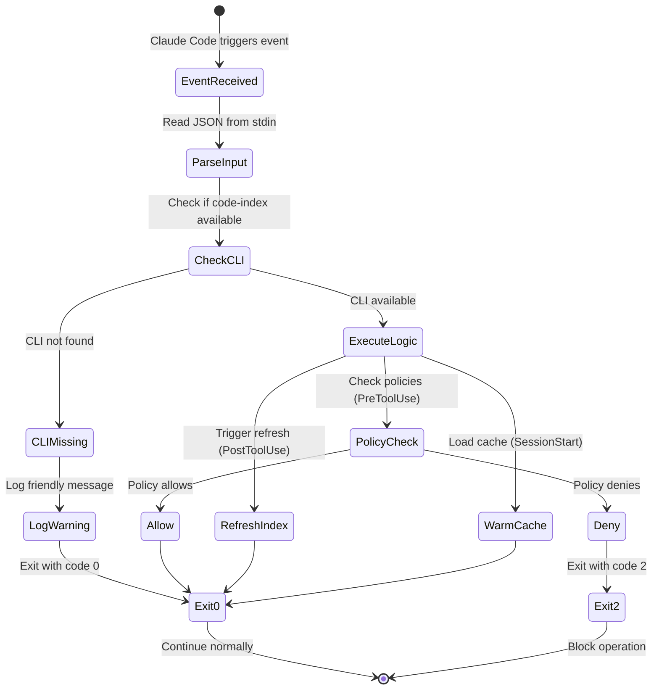
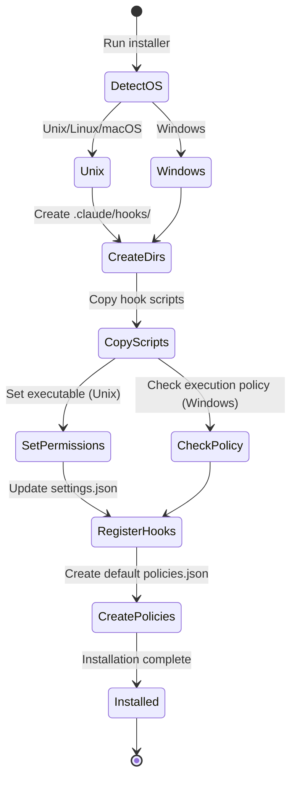

# Data Model: Claude Code Hooks and Installers

**Date**: 2025-10-12
**Feature**: Claude Code Hooks Integration

## Entity Definitions

### 1. HookEvent

Represents the event data passed from Claude Code to hooks via stdin.

```typescript
interface HookEvent {
  // Common fields for all events
  session_id: string;              // Unique session identifier
  transcript_path: string;         // Path to session transcript
  cwd: string;                     // Current working directory
  hook_event_name: HookEventType;  // Type of event

  // Event-specific fields
  tool_name?: string;              // Tool being invoked (PreToolUse, PostToolUse)
  tool_input?: Record<string, any>; // Tool parameters
  tool_response?: ToolResponse;    // Tool execution result (PostToolUse)
  source?: SessionSource;          // Session start source (SessionStart)
  prompt?: string;                 // User prompt text (UserPromptSubmit)
  message?: string;                // Notification message (Notification)
  stop_hook_active?: boolean;      // Stop hook state (Stop, SubagentStop)
  trigger?: CompactTrigger;        // Compact trigger type (PreCompact)
  custom_instructions?: string;    // Custom compact instructions (PreCompact)
  reason?: SessionEndReason;       // Session end reason (SessionEnd)
}

enum HookEventType {
  PreToolUse = "PreToolUse",
  PostToolUse = "PostToolUse",
  SessionStart = "SessionStart",
  UserPromptSubmit = "UserPromptSubmit",
  Stop = "Stop",
  Notification = "Notification",
  SubagentStop = "SubagentStop",
  PreCompact = "PreCompact",
  SessionEnd = "SessionEnd"
}

enum SessionSource {
  Startup = "startup",
  Resume = "resume",
  Clear = "clear",
  Compact = "compact"
}

enum CompactTrigger {
  Manual = "manual",
  Auto = "auto"
}

enum SessionEndReason {
  Clear = "clear",
  Logout = "logout",
  PromptInputExit = "prompt_input_exit",
  Other = "other"
}
```

### 2. HookResponse

Represents the optional JSON response a hook can provide.

```typescript
interface HookResponse {
  // Control fields
  decision?: "allow" | "deny" | "ask" | "block";
  reason?: string;                  // Explanation for decision
  continue?: boolean;                // Whether to continue processing
  suppressOutput?: boolean;          // Suppress output to Claude

  // Hook-specific output
  hookSpecificOutput?: {
    hookEventName: HookEventType;
    permissionDecision?: "allow" | "deny" | "ask";
    permissionDecisionReason?: string;
    additionalContext?: string;     // Context to inject
  };
}
```

### 3. HookConfiguration

Represents the configuration for a single hook in settings.json.

```typescript
interface HookConfiguration {
  type: "command";                   // Currently only command type supported
  command: string;                   // Shell command to execute
  timeout?: number;                  // Timeout in seconds (default: 60)
}

interface HookMatcher {
  matcher?: string;                  // Regex pattern for tool names
  hooks: HookConfiguration[];       // Array of hooks to execute
}

interface HookSettings {
  hooks: {
    [K in HookEventType]?: HookMatcher[];
  };
}
```

### 4. PolicyRule

Represents a policy rule for PreToolUse hook enforcement.

```typescript
interface PolicyRule {
  id: string;                        // Unique rule identifier
  name: string;                      // Human-readable name
  description?: string;              // Rule description
  enabled: boolean;                  // Whether rule is active

  // Matching criteria
  tools?: string[];                  // Tool names to match
  patterns?: string[];               // Regex patterns to match against input
  paths?: string[];                  // File paths to check

  // Action to take
  action: "allow" | "deny" | "warn";
  message?: string;                  // Custom message for denial

  // Metadata
  severity?: "low" | "medium" | "high" | "critical";
  created_at: string;                // ISO timestamp
  updated_at: string;                // ISO timestamp
}

interface PolicyConfiguration {
  version: string;                   // Policy version
  rules: PolicyRule[];              // Array of policy rules
  default_action?: "allow" | "deny"; // Default if no rules match
}
```

### 5. InstallationState

Represents the current installation status of hooks.

```typescript
interface InstallationState {
  version: string;                   // Installation version
  platform: "unix" | "windows";      // Detected platform
  installed_at: string;              // ISO timestamp

  hooks: {
    pre_tool_use: HookInstallStatus;
    post_tool_use: HookInstallStatus;
    session_start: HookInstallStatus;
  };

  components: {
    policies_file: boolean;          // .claude/policies.json exists
    settings_file: boolean;          // .claude/settings.json exists
    log_directory: boolean;          // .codeindex/logs/ exists
    cli_available: boolean;          // code-index CLI found
  };
}

interface HookInstallStatus {
  installed: boolean;                // Hook file exists
  path: string;                      // Full path to hook script
  executable?: boolean;              // Has execute permission (Unix)
  registered: boolean;               // Registered in settings.json
}
```

### 6. CacheState

Represents cached data for SessionStart optimization.

```typescript
interface CacheState {
  // Cache metadata
  cache_key: string;                 // Unique cache identifier
  created_at: string;                // ISO timestamp
  expires_at: string;                // ISO timestamp
  hit_count: number;                 // Number of cache hits

  // Cached data
  index_stats: {
    total_files: number;
    indexed_files: number;
    last_refresh: string;            // ISO timestamp
    database_size: number;           // Bytes
  };

  frequent_queries: Array<{
    query: string;
    count: number;
    last_used: string;               // ISO timestamp
  }>;

  system_health: {
    cli_version: string;
    disk_space_available: number;    // Bytes
    memory_available: number;        // Bytes
    last_check: string;              // ISO timestamp
  };
}
```

### 7. LogEntry

Represents a structured log entry for hook operations.

```typescript
interface LogEntry {
  timestamp: string;                 // ISO timestamp
  level: "debug" | "info" | "warn" | "error";
  hook: HookEventType;
  session_id?: string;

  // Event details
  event: string;                     // Event description
  tool_name?: string;
  action_taken?: "allowed" | "blocked" | "warned";

  // Performance metrics
  duration_ms?: number;              // Execution time
  exit_code?: number;

  // Error information
  error?: {
    message: string;
    stack?: string;
    code?: string;
  };

  // Additional context
  metadata?: Record<string, any>;
}
```

### 8. ToolResponse

Represents the response from a Claude Code tool execution.

```typescript
interface ToolResponse {
  success: boolean;                  // Whether tool succeeded
  filePath?: string;                 // File operated on (Write, Edit)
  output?: string;                   // Command output (Bash)
  error?: string;                    // Error message if failed
  files?: string[];                  // Multiple files affected
  changes?: number;                  // Number of changes made
}
```

## Relationships



## State Transitions

### Hook Execution Flow



### Installation State Flow



## Validation Rules

### PolicyRule Validation

- `id` must be unique across all rules
- `tools` array items must match known Claude Code tool names
- `patterns` must be valid regex expressions
- `paths` should not contain path traversal sequences (`..`)
- `action` must be one of: allow, deny, warn
- `severity` affects logging and reporting priority

### HookEvent Validation

- `session_id` must be non-empty string
- `transcript_path` must be valid file path
- `hook_event_name` must match known event types
- `tool_name` required for PreToolUse and PostToolUse events
- `tool_input` must be valid JSON object when present

### LogEntry Validation

- `timestamp` must be valid ISO 8601 format
- `duration_ms` must be positive integer
- `exit_code` must be integer 0-255
- Log files must not exceed 10MB (rotation required)

## Storage Locations

| Data Type | Location | Format |
|-----------|----------|--------|
| Hook Scripts | `.claude/hooks/*.sh` or `.ps1` | Shell scripts |
| Settings | `.claude/settings.json` | JSON |
| Policies | `.claude/policies.json` | JSON |
| Logs | `.codeindex/logs/[hook-name].jsonl` | JSON Lines |
| Cache | `.codeindex/cache/session-start.json` | JSON |
| Lock Files | `/tmp/claude-hook-*.lock` (Unix) | Lock files |
| | `%TEMP%\claude-hook-*.lock` (Windows) | Lock files |

## Performance Constraints

- Hook execution timeout: 60 seconds (configurable)
- Policy check latency: < 500ms
- Index refresh trigger: < 2 seconds
- Cache warm time: < 1 second
- Log rotation threshold: 10MB per file
- Maximum concurrent hooks: 10 (parallel execution)