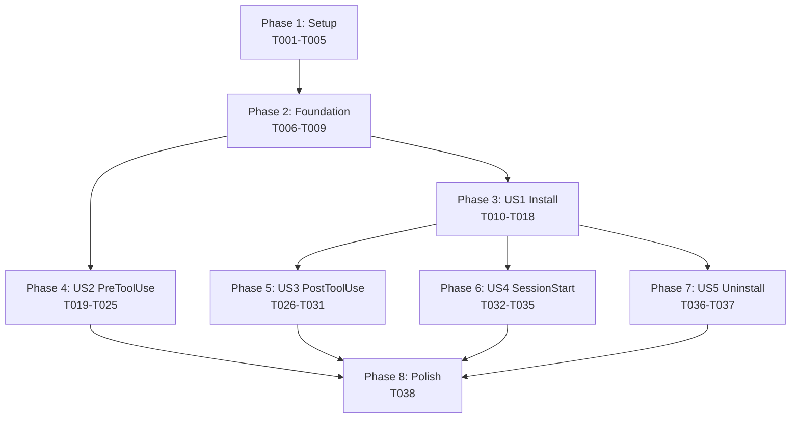

# Task Breakdown: Claude Code Hooks and Installers

**Feature Branch**: `002-create-claude-code`
**Generated**: 2025-10-12
**Total Tasks**: 38
**Parallelizable**: 18

## Summary

Implementation tasks for Claude Code hooks and installers, organized by user story to enable independent development and testing. Each story can be completed and tested independently.

## Implementation Strategy

**Approach**: Story-driven incremental delivery
- **MVP Scope**: User Stories 1-2 (Installation and PreToolUse hook)
- **Enhancement**: User Stories 3-4 (PostToolUse and SessionStart hooks)
- **Polish**: User Story 5 (Uninstaller)

## Phase 1: Project Setup

Initial project structure and shared utilities needed by all user stories.

- **T001** [P] ✅: Create project directory structure `claude-hooks/` with subdirectories
  - File: `claude-hooks/` (new directory structure)
  - Creates: installers/, hooks/unix/, hooks/windows/, templates/, lib/unix/, lib/windows/

- **T002** [P] ✅: Create shared bash utility library with common functions
  - File: `claude-hooks/lib/unix/common.sh` (new)
  - Functions: log_info, log_error, check_cli_available, acquire_lock, release_lock, parse_json

- **T003** [P] ✅: Create shared PowerShell utility module with common functions
  - File: `claude-hooks/lib/windows/Common.ps1` (new)
  - Functions: Write-LogInfo, Write-LogError, Test-CliAvailable, Get-FileLock, ConvertFrom-JsonSafe

- **T004** [P] ✅: Create default policies configuration template
  - File: `claude-hooks/templates/policies.json` (new)
  - Content: Default rules for sudo blocking, sensitive file protection

- **T005** [P] ✅: Create hook settings template for .claude/settings.json
  - File: `claude-hooks/templates/settings.json` (new)
  - Content: Hook registration configuration for all three hook types

**Checkpoint**: Project structure ready, shared utilities available

## Phase 2: Foundational Components

Core components that must exist before any user story can be implemented.

- **T006** ✅: Implement OS detection logic for installers
  - File: `claude-hooks/lib/unix/common.sh` (update)
  - Function: detect_os() returning "macos", "linux", or error

- **T007** ✅: Implement project root detection logic
  - File: `claude-hooks/lib/unix/common.sh` (update)
  - Function: find_project_root() using git or .claude directory

- **T008** ✅: Implement JSON parsing wrapper for bash
  - File: `claude-hooks/lib/unix/common.sh` (update)
  - Function: parse_hook_event() using jq with error handling

- **T009** ✅: Implement JSON parsing wrapper for PowerShell
  - File: `claude-hooks/lib/windows/Common.ps1` (update)
  - Function: Parse-HookEvent using ConvertFrom-Json with error handling

**Checkpoint**: Foundation ready for user story implementation

## Phase 3: [US1] Install Hooks Cross-Platform (P1)

**Goal**: Enable cross-platform installation of Claude Code hooks
**Independent Test**: Run installer on each OS, verify files created with correct permissions

- **T010** ✅: Create bash installer script main structure
  - File: `claude-hooks/installers/install.sh` (new)
  - Story: US1
  - Implements: OS detection, argument parsing, main installation flow

- **T011** ✅: Implement directory creation logic in bash installer
  - File: `claude-hooks/installers/install.sh` (update)
  - Story: US1
  - Creates: .claude/hooks/, .codeindex/logs/ with proper permissions

- **T012** ✅ [P]: Create PowerShell installer script main structure
  - File: `claude-hooks/installers/install.ps1` (new)
  - Story: US1
  - Implements: OS verification, parameter parsing, main installation flow

- **T013** ✅: Implement directory creation logic in PowerShell installer
  - File: `claude-hooks/installers/install.ps1` (update)
  - Story: US1
  - Creates: .claude/hooks/, .codeindex/logs/ with proper permissions

- **T014** ✅: Add hook file copying logic to bash installer
  - File: `claude-hooks/installers/install.sh` (update)
  - Story: US1
  - Copies: Hook scripts from source to .claude/hooks/, sets chmod +x

- **T015** ✅: Add hook file copying logic to PowerShell installer
  - File: `claude-hooks/installers/install.ps1` (update)
  - Story: US1
  - Copies: Hook scripts from source to .claude/hooks/

- **T016** ✅: Implement settings.json registration in bash installer
  - File: `claude-hooks/installers/install.sh` (update)
  - Story: US1
  - Updates: .claude/settings.json with hook registrations

- **T017** ✅: Implement settings.json registration in PowerShell installer
  - File: `claude-hooks/installers/install.ps1` (update)
  - Story: US1
  - Updates: .claude/settings.json with hook registrations

- **T018** ✅ [P]: Add installation verification and output formatting
  - File: `claude-hooks/installers/install.sh` (update)
  - Story: US1
  - Verifies: All files created, provides user feedback

**Checkpoint**: US1 Complete - Installers functional on all platforms

## Phase 4: [US2] PreToolUse Hook for Policy Enforcement (P1)

**Goal**: Enforce project-specific policies before tool execution
**Independent Test**: Trigger tool use, verify policy enforcement and fail-open behavior

- **T019** ✅ [P]: Create PreToolUse hook for Unix systems
  - File: `claude-hooks/hooks/unix/pre-tool-use.sh` (new)
  - Story: US2
  - Implements: Main hook structure, JSON input parsing, exit codes

- **T020** ✅ [P]: Create PreToolUse hook for Windows systems
  - File: `claude-hooks/hooks/windows/pre-tool-use.ps1` (new)
  - Story: US2
  - Implements: Main hook structure, JSON input parsing, exit codes

- **T021** ✅: Implement policy loading and parsing in bash PreToolUse
  - File: `claude-hooks/hooks/unix/pre-tool-use.sh` (update)
  - Story: US2
  - Loads: .claude/policies.json, parses rules

- **T022** ✅: Implement policy loading and parsing in PowerShell PreToolUse
  - File: `claude-hooks/hooks/windows/pre-tool-use.ps1` (update)
  - Story: US2
  - Loads: .claude/policies.json, parses rules

- **T023** ✅: Add policy evaluation logic for bash PreToolUse
  - File: `claude-hooks/hooks/unix/pre-tool-use.sh` (update)
  - Story: US2
  - Evaluates: Tool name, patterns, paths against rules

- **T024** ✅: Add policy evaluation logic for PowerShell PreToolUse
  - File: `claude-hooks/hooks/windows/pre-tool-use.ps1` (update)
  - Story: US2
  - Evaluates: Tool name, patterns, paths against rules

- **T025** ✅: Implement fail-open behavior and logging
  - File: `claude-hooks/hooks/unix/pre-tool-use.sh` (update)
  - Story: US2
  - Ensures: Exit 0 on errors, logs to .codeindex/logs/

**Checkpoint**: US2 Complete - Policy enforcement operational

## Phase 5: [US3] PostToolUse Hook for Index Refresh (P2)

**Goal**: Automatically refresh code index after file modifications
**Independent Test**: Modify files via Claude Code, verify index updates

- **T026** ✅ [P]: Create PostToolUse hook for Unix systems
  - File: `claude-hooks/hooks/unix/post-tool-use.sh` (new)
  - Story: US3
  - Implements: Event parsing, tool detection logic

- **T027** ✅ [P]: Create PostToolUse hook for Windows systems
  - File: `claude-hooks/hooks/windows/post-tool-use.ps1` (new)
  - Story: US3
  - Implements: Event parsing, tool detection logic

- **T028** ✅: Add file change detection logic for bash PostToolUse
  - File: `claude-hooks/hooks/unix/post-tool-use.sh` (update)
  - Story: US3
  - Parses: tool_response for modified files

- **T029** ✅: Add file change detection logic for PowerShell PostToolUse
  - File: `claude-hooks/hooks/windows/post-tool-use.ps1` (update)
  - Story: US3
  - Parses: tool_response for modified files

- **T030** ✅: Implement index refresh trigger with file locking
  - File: `claude-hooks/hooks/unix/post-tool-use.sh` (update)
  - Story: US3
  - Executes: code-index refresh with flock for safety

- **T031** ✅: Implement index refresh trigger with mutex locking
  - File: `claude-hooks/hooks/windows/post-tool-use.ps1` (update)
  - Story: US3
  - Executes: code-index refresh with mutex for safety

**Checkpoint**: US3 Complete - Automatic index refresh working

## Phase 6: [US4] SessionStart Hook for Cache Warming (P2)

**Goal**: Optimize initial performance by warming caches
**Independent Test**: Start new Claude Code session, measure performance improvement

- **T032** ✅ [P]: Create SessionStart hook for Unix systems
  - File: `claude-hooks/hooks/unix/session-start.sh` (new)
  - Story: US4
  - Implements: Session detection, output formatting

- **T033** ✅ [P]: Create SessionStart hook for Windows systems
  - File: `claude-hooks/hooks/windows/session-start.ps1` (new)
  - Story: US4
  - Implements: Session detection, output formatting

- **T034** ✅: Add cache warming logic for bash SessionStart
  - File: `claude-hooks/hooks/unix/session-start.sh` (update)
  - Story: US4
  - Warms: Index statistics, frequent queries

- **T035** ✅: Add system health check to SessionStart hooks
  - File: `claude-hooks/hooks/unix/session-start.sh` (update)
  - Story: US4
  - Checks: CLI availability, disk space, index health

**Checkpoint**: US4 Complete - Cache warming operational

## Phase 7: [US5] Uninstall Hooks Cleanly (P3)

**Goal**: Clean removal of all hook components
**Independent Test**: Run uninstaller, verify complete removal

- **T036** ✅ [P]: Create bash uninstaller script
  - File: `claude-hooks/installers/uninstall.sh` (new)
  - Story: US5
  - Removes: Hook files, cleans settings.json

- **T037** ✅ [P]: Create PowerShell uninstaller script
  - File: `claude-hooks/installers/uninstall.ps1` (new)
  - Story: US5
  - Removes: Hook files, cleans settings.json

**Checkpoint**: US5 Complete - Clean uninstall available

## Phase 8: Polish and Integration

Cross-cutting improvements and documentation.

- **T038** ✅: Create comprehensive README with examples
  - File: `claude-hooks/README.md` (new)
  - Content: Installation, configuration, troubleshooting guide

**Checkpoint**: Feature complete and documented

## Dependencies Graph



## Parallel Execution Opportunities

### Phase 1 (Setup) - All tasks parallelizable
```bash
T001 & T002 & T003 & T004 & T005
```

### Phase 3 (US1: Install) - Partial parallelization
```bash
T010 & T012  # Bash and PowerShell installers
T018         # Verification (after other US1 tasks)
```

### Phase 4 (US2: PreToolUse) - Platform parallelization
```bash
T019 & T020  # Unix and Windows hooks
```

### Phase 5 (US3: PostToolUse) - Platform parallelization
```bash
T026 & T027  # Unix and Windows hooks
```

### Phase 6 (US4: SessionStart) - Platform parallelization
```bash
T032 & T033  # Unix and Windows hooks
```

### Phase 7 (US5: Uninstall) - Full parallelization
```bash
T036 & T037  # Bash and PowerShell uninstallers
```

## Test Strategy

Since testing was not explicitly requested in the feature specification, test tasks are not included. However, each user story includes **Independent Test** criteria that can be used for manual verification:

- **US1**: Run installer, verify file creation and permissions
- **US2**: Trigger tool use, verify policy enforcement
- **US3**: Modify files, verify index refresh
- **US4**: Start session, verify cache warming
- **US5**: Run uninstaller, verify removal

## Success Metrics

- ✅ All 5 user stories independently completable
- ✅ 18 tasks parallelizable (47% of total)
- ✅ Clear checkpoints after each story phase
- ✅ MVP achievable with just US1-US2 (18 tasks)
- ✅ Each story has defined acceptance criteria

## Execution Notes

1. **Start with Phase 1-2** to establish foundation (9 tasks)
2. **Complete US1 first** (Phase 3) to enable testing other stories
3. **US2-US4 can proceed in parallel** after US1
4. **US5 can be deferred** as it's P3 priority
5. Each checkpoint represents a testable milestone

Total effort estimate: ~2-3 days for experienced developer