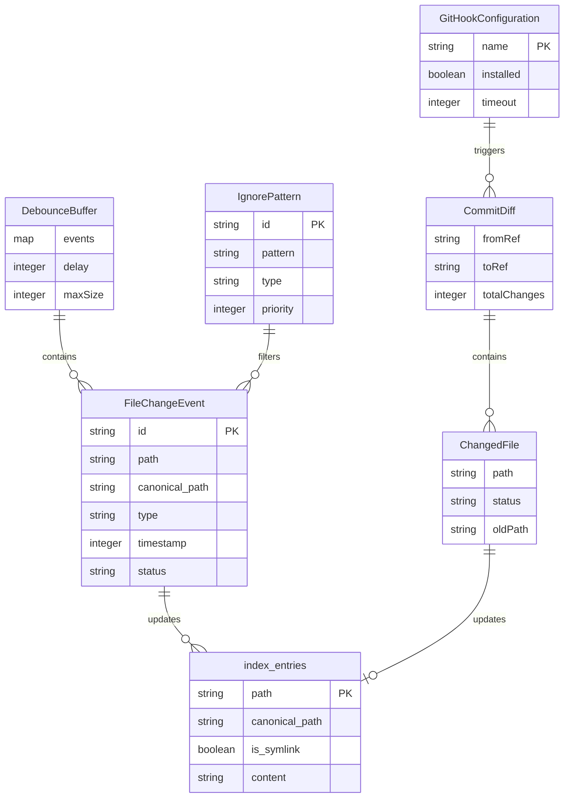

# Data Model: File Watcher and Git Hooks

**Feature**: File Watcher and Git Hooks for Incremental Indexing
**Date**: 2025-10-12
**Status**: Complete

## Entity Definitions

### 1. FileChangeEvent

Represents a detected file system change event.

```typescript
interface FileChangeEvent {
  // Core identifiers
  id: string;                    // UUID for deduplication
  path: string;                   // Relative path from project root
  canonicalPath: string;          // Resolved canonical path (follows symlinks)

  // Event metadata
  type: FileChangeType;           // Type of change detected
  timestamp: number;              // Unix timestamp when detected

  // Processing state
  status: ProcessingStatus;       // Current processing status
  retryCount: number;             // Number of retry attempts
  error?: string;                 // Last error if processing failed

  // File metadata
  size?: number;                  // File size in bytes
  isDirectory: boolean;           // Whether path is a directory
  isSymlink: boolean;             // Whether path is a symlink
}

enum FileChangeType {
  CREATE = 'create',
  MODIFY = 'modify',
  DELETE = 'delete',
  RENAME = 'rename'
}

enum ProcessingStatus {
  PENDING = 'pending',
  PROCESSING = 'processing',
  COMPLETED = 'completed',
  FAILED = 'failed',
  SKIPPED = 'skipped'
}
```

**Validation Rules**:
- `path` must be a valid file system path
- `canonicalPath` must be absolute
- `timestamp` must be a positive integer
- `retryCount` must be >= 0 and <= 3
- `size` must be >= 0 when present

**State Transitions**:
```
PENDING → PROCESSING → COMPLETED
       ↓            ↓
       → FAILED ← ─┘
       ↓
       → SKIPPED
```

### 2. DebounceBuffer

Represents accumulated changes waiting to be processed after delay period.

```typescript
interface DebounceBuffer {
  // Buffer state
  events: Map<string, FileChangeEvent>;  // Keyed by canonical path
  createdAt: number;                      // When buffer was created
  lastModified: number;                   // Last event addition time

  // Configuration
  delay: number;                          // Debounce delay in ms
  maxSize: number;                        // Maximum buffer size

  // Processing
  timer?: NodeJS.Timeout;                 // Active timer reference
  processingBatch?: string;                // Current batch ID being processed
}
```

**Validation Rules**:
- `delay` must be between 100ms and 10000ms
- `maxSize` must be between 1 and 10000
- `events.size` must not exceed `maxSize`
- `lastModified` >= `createdAt`

**Event Coalescing Rules**:
1. Multiple MODIFY events on same file → single MODIFY
2. CREATE followed by DELETE → remove both (net zero)
3. MODIFY followed by DELETE → single DELETE
4. CREATE followed by MODIFY → single CREATE

### 3. IgnorePattern

Represents a rule for excluding files or directories from watching and indexing.

```typescript
interface IgnorePattern {
  // Pattern definition
  id: string;                    // Unique identifier
  pattern: string;               // Glob or regex pattern
  type: PatternType;             // Type of pattern

  // Metadata
  source: PatternSource;         // Where pattern came from
  priority: number;              // Higher priority patterns evaluated first
  enabled: boolean;              // Whether pattern is active

  // Statistics
  matchCount: number;            // Number of times pattern matched
  lastMatched?: number;          // Last match timestamp
}

enum PatternType {
  GLOB = 'glob',                 // e.g., "**/*.log"
  REGEX = 'regex',               // e.g., "/\.tmp$/i"
  EXACT = 'exact'                // e.g., "node_modules"
}

enum PatternSource {
  DEFAULT = 'default',           // Built-in defaults
  GITIGNORE = 'gitignore',      // From .gitignore
  CONFIG = 'config',            // User configuration
  RUNTIME = 'runtime'           // Added dynamically
}
```

**Validation Rules**:
- `pattern` must be valid for its `type`
- `priority` must be between 0 and 1000
- `matchCount` must be >= 0
- Default patterns cannot be disabled

**Default Patterns**:
```typescript
const DEFAULT_IGNORE_PATTERNS = [
  { pattern: '**/node_modules/**', type: 'GLOB', priority: 900 },
  { pattern: '**/.git/**', type: 'GLOB', priority: 900 },
  { pattern: '**/.codeindex/**', type: 'GLOB', priority: 1000 },
  { pattern: '**/dist/**', type: 'GLOB', priority: 800 },
  { pattern: '**/build/**', type: 'GLOB', priority: 800 },
  { pattern: '**/*.log', type: 'GLOB', priority: 700 }
];
```

### 4. CommitDiff

Represents changes between commits with affected file lists.

```typescript
interface CommitDiff {
  // Commit references
  fromRef: string;               // Starting commit/branch/tag
  toRef: string;                 // Ending commit/branch/tag

  // Changed files
  files: ChangedFile[];          // List of affected files
  totalChanges: number;          // Total number of changes

  // Metadata
  timestamp: number;             // When diff was calculated
  source: DiffSource;            // How diff was triggered
}

interface ChangedFile {
  path: string;                  // File path relative to repo root
  status: ChangeStatus;          // Type of change
  oldPath?: string;              // Previous path for renames
  additions?: number;            // Lines added
  deletions?: number;            // Lines removed
}

enum ChangeStatus {
  ADDED = 'A',
  MODIFIED = 'M',
  DELETED = 'D',
  RENAMED = 'R',
  COPIED = 'C',
  UNMERGED = 'U'
}

enum DiffSource {
  MANUAL = 'manual',             // --changed flag
  HOOK_MERGE = 'hook_merge',     // post-merge hook
  HOOK_CHECKOUT = 'hook_checkout', // post-checkout hook
  HOOK_REWRITE = 'hook_rewrite'  // post-rewrite hook
}
```

**Validation Rules**:
- `fromRef` and `toRef` must be valid Git references
- `totalChanges` must equal `files.length`
- `oldPath` required when `status` is RENAMED
- `additions` and `deletions` >= 0 when present

### 5. GitHookConfiguration

Represents installed hooks and their triggering conditions.

```typescript
interface GitHookConfiguration {
  // Hook identity
  name: GitHookType;             // Type of Git hook
  path: string;                  // Path to hook script

  // Installation state
  installed: boolean;            // Whether hook is installed
  installedAt?: number;          // Installation timestamp
  version: string;               // Hook script version

  // Configuration
  enabled: boolean;              // Whether hook is active
  blocking: boolean;             // Whether hook blocks Git operation
  timeout: number;               // Maximum execution time (ms)

  // Execution statistics
  executionCount: number;        // Number of times executed
  lastExecuted?: number;         // Last execution timestamp
  averageRuntime?: number;       // Average execution time (ms)
  failureCount: number;          // Number of failures
}

enum GitHookType {
  POST_MERGE = 'post-merge',
  POST_CHECKOUT = 'post-checkout',
  POST_REWRITE = 'post-rewrite'
}
```

**Validation Rules**:
- `path` must exist if `installed` is true
- `timeout` must be between 1000ms and 30000ms
- `version` must follow semver format
- `blocking` must be false (non-blocking requirement)

**Hook Script Template**:
```bash
#!/bin/sh
# code-index hook v1.0.0
# Non-blocking execution with timeout
(
  timeout 5s code-index refresh --git-range "$1..$2" \
    >> .codeindex/logs/git-hook.log 2>&1
) &
exit 0
```

## Database Schema Extensions

### New Tables

```sql
-- File change events for processing
CREATE TABLE IF NOT EXISTS file_change_events (
  id TEXT PRIMARY KEY,
  path TEXT NOT NULL,
  canonical_path TEXT NOT NULL,
  type TEXT CHECK(type IN ('create', 'modify', 'delete', 'rename')),
  timestamp INTEGER NOT NULL,
  status TEXT CHECK(status IN ('pending', 'processing', 'completed', 'failed', 'skipped')),
  retry_count INTEGER DEFAULT 0,
  error TEXT,
  size INTEGER,
  is_directory INTEGER DEFAULT 0,
  is_symlink INTEGER DEFAULT 0,
  created_at INTEGER DEFAULT (strftime('%s', 'now')),

  INDEX idx_status (status),
  INDEX idx_canonical_path (canonical_path),
  INDEX idx_timestamp (timestamp)
);

-- Ignore patterns configuration
CREATE TABLE IF NOT EXISTS ignore_patterns (
  id TEXT PRIMARY KEY,
  pattern TEXT NOT NULL UNIQUE,
  type TEXT CHECK(type IN ('glob', 'regex', 'exact')),
  source TEXT CHECK(source IN ('default', 'gitignore', 'config', 'runtime')),
  priority INTEGER DEFAULT 500,
  enabled INTEGER DEFAULT 1,
  match_count INTEGER DEFAULT 0,
  last_matched INTEGER,
  created_at INTEGER DEFAULT (strftime('%s', 'now')),

  INDEX idx_enabled_priority (enabled, priority DESC)
);

-- Git hook configuration
CREATE TABLE IF NOT EXISTS git_hooks (
  name TEXT PRIMARY KEY CHECK(name IN ('post-merge', 'post-checkout', 'post-rewrite')),
  path TEXT,
  installed INTEGER DEFAULT 0,
  installed_at INTEGER,
  version TEXT,
  enabled INTEGER DEFAULT 1,
  blocking INTEGER DEFAULT 0,
  timeout INTEGER DEFAULT 5000,
  execution_count INTEGER DEFAULT 0,
  last_executed INTEGER,
  average_runtime INTEGER,
  failure_count INTEGER DEFAULT 0,

  CHECK(blocking = 0), -- Enforce non-blocking requirement
  CHECK(timeout BETWEEN 1000 AND 30000)
);

-- Watcher state for recovery
CREATE TABLE IF NOT EXISTS watcher_state (
  id INTEGER PRIMARY KEY CHECK(id = 1), -- Single row table
  watching INTEGER DEFAULT 0,
  started_at INTEGER,
  last_event_at INTEGER,
  events_processed INTEGER DEFAULT 0,
  events_skipped INTEGER DEFAULT 0,
  events_failed INTEGER DEFAULT 0,
  memory_usage INTEGER,
  debounce_delay INTEGER DEFAULT 500,
  batch_size INTEGER DEFAULT 100,

  CHECK(debounce_delay BETWEEN 100 AND 10000),
  CHECK(batch_size BETWEEN 1 AND 1000)
);
```

### Modified Tables

```sql
-- Add canonical path to existing index_entries table
ALTER TABLE index_entries ADD COLUMN canonical_path TEXT;
ALTER TABLE index_entries ADD COLUMN is_symlink INTEGER DEFAULT 0;
ALTER TABLE index_entries ADD COLUMN symlink_target TEXT;

-- Create index for efficient duplicate detection
CREATE INDEX IF NOT EXISTS idx_canonical_path ON index_entries(canonical_path);
```

## Relationships



## Data Flow

### 1. File System Event Flow
```
File System Change
    ↓
FileChangeEvent created
    ↓
IgnorePattern filtering
    ↓ (if not ignored)
DebounceBuffer accumulation
    ↓ (after delay)
Batch processing
    ↓
index_entries update
```

### 2. Git Hook Flow
```
Git Operation (merge/checkout/rewrite)
    ↓
GitHookConfiguration triggered
    ↓
CommitDiff generated
    ↓
ChangedFile list created
    ↓
FileChangeEvent batch created
    ↓
index_entries update
```

### 3. Manual --changed Mode Flow
```
CLI --changed flag
    ↓
Git diff HEAD~1..HEAD
    ↓
CommitDiff generated
    ↓
ChangedFile list created
    ↓
Direct batch indexing
    ↓
index_entries update
```

## Performance Considerations

### Indexes
- `canonical_path` for duplicate detection
- `status` for queue processing
- `timestamp` for event ordering
- `(enabled, priority)` for pattern evaluation

### Batch Operations
- Process FileChangeEvents in batches of 100
- Use single transaction per batch
- Prepared statements for all operations

### Memory Management
- Limit DebounceBuffer to 10,000 events
- LRU cache for canonical path lookups (10k entries)
- Clear processed events immediately

## Migration Strategy

For existing code-index installations:

1. **Schema Migration**:
   ```sql
   -- Run in transaction
   BEGIN;

   -- Add new columns to existing tables
   ALTER TABLE index_entries ADD COLUMN canonical_path TEXT;
   ALTER TABLE index_entries ADD COLUMN is_symlink INTEGER DEFAULT 0;

   -- Populate canonical_path for existing entries
   UPDATE index_entries SET canonical_path = path WHERE canonical_path IS NULL;

   -- Create new tables
   -- ... (create statements from above)

   COMMIT;
   ```

2. **Data Migration**:
   - Populate canonical_path for existing entries
   - Insert default ignore patterns
   - Initialize watcher_state with defaults

3. **Backward Compatibility**:
   - Old index_entries remain valid
   - Watcher features are opt-in
   - Git hooks require manual installation