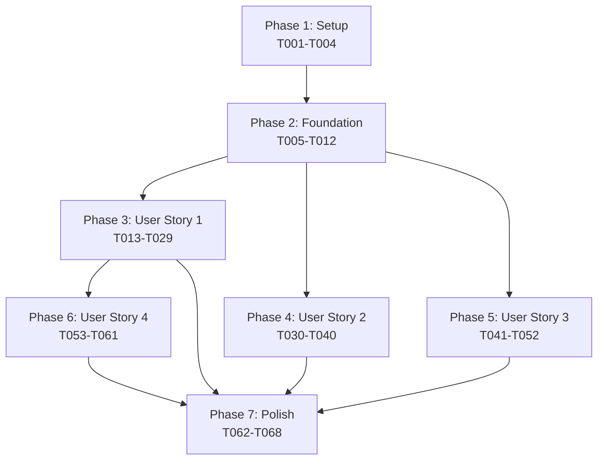

# Implementation Tasks: File Watcher and Git Hooks for Incremental Indexing

**Feature Branch**: `003-implement-a-watcher`
**Total Tasks**: 68
**Estimated Effort**: 3-4 days
**Dependencies**: chokidar, simple-git

## Overview

This document provides an actionable task list for implementing the file watcher feature with Git hooks support. Tasks are organized by user story to enable incremental delivery and independent testing.

## Phase Organization

- **Phase 1**: Setup (T001-T004) - Project initialization
- **Phase 2**: Foundational (T005-T012) - Blocking prerequisites
- **Phase 3**: User Story 1 (T013-T029) - Real-time file watching [P1]
- **Phase 4**: User Story 2 (T030-T040) - Changed mode for commits [P2]
- **Phase 5**: User Story 3 (T041-T052) - Git hooks integration [P2]
- **Phase 6**: User Story 4 (T053-T061) - Ignore pattern configuration [P3]
- **Phase 7**: Polish (T062-T068) - Cross-cutting concerns

## Phase 1: Setup Tasks

### [Setup] Project Dependencies and Configuration

**T001** [P] Install new dependencies [X]
- File: `package.json`
- Add: `chokidar@^3.6.0`, `simple-git@^3.28.0`
- Run: `npm install`

**T002** [P] Update TypeScript configuration [X]
- File: `tsconfig.json`
- Ensure: Node.js types include fs, path, process
- Add: Type definitions for chokidar and simple-git

**T003** [P] Create watcher configuration schema [X]
- File: `src/models/WatcherConfig.ts`
- Define: Interface for watcher configuration options
- Include: debounceDelay, batchSize, maxQueueSize, ignorePatterns, etc.

**T004** [P] Update CLI command structure [X]
- File: `src/cli/index.ts`
- Import: New watch and hooks commands
- Register: Commands with commander.js

---

## Phase 2: Foundational Tasks

### [Foundation] Core Infrastructure

**T005** Update database schema for watcher support [X]
- File: `src/services/database/migrations/003_watcher.sql`
- Create: Tables for file_change_events, ignore_patterns, git_hooks, watcher_state
- Add: Canonical path column to index_entries
- Create: Necessary indexes

**T006** [P] Create base error types for watcher [X]
- File: `src/lib/errors/WatcherErrors.ts`
- Define: FileAccessError, WatcherTimeoutError, GitHookError
- Include: Error categorization (transient, permanent, fatal)

**T007** [P] Implement retry manager with exponential backoff [X]
- File: `src/lib/RetryManager.ts`
- Implement: Retry logic with configurable attempts (3) and delays (1s, 2s, 4s)
- Handle: Different error categories
- Export: RetryManager class

**T008** [P] Create file system utilities [X]
- File: `src/lib/FileSystemUtils.ts`
- Implement: getCanonicalPath, checkFileAccess, detectFilesystemType
- Handle: Symlinks, permissions, network drives

**T009** Create incremental indexer base [X]
- File: `src/services/indexer/IncrementalIndexer.ts`
- Implement: Base incremental indexing logic
- Use: Existing database service
- Support: Batch processing with transactions

**T010** [P] Set up logging for watcher operations [X]
- File: `src/cli/utils/WatcherLogger.ts`
- Extend: Existing logger for watcher-specific needs
- Support: JSON lines format to `.codeindex/logs/watcher.jsonl`

**T011** [P] Create performance monitoring utilities [X]
- File: `src/lib/PerformanceMonitor.ts`
- Track: Memory usage, event processing times
- Alert: When thresholds exceeded (400MB memory)

**T012** Initialize watcher state management [X]
- File: `src/services/watcher/WatcherState.ts`
- Implement: State persistence to database
- Track: watching status, events processed, memory usage

### Checkpoint: Foundation Complete
- Database schema updated
- Core utilities implemented
- Error handling and retry logic ready
- Incremental indexer base complete

---

## Phase 3: User Story 1 - Real-time File Watching [P1]

### Goal: Monitor file system and auto-reindex with debouncing

**Independent Test Criteria**:
- Start watcher and verify it detects file changes
- Confirm debouncing batches multiple rapid changes
- Verify index updates correctly for create/modify/rename/delete
- Ensure ignored directories are excluded

### [US1] Core Models

**T013** [P] Implement FileChangeEvent model [X]
- File: `src/models/FileChangeEvent.ts`
- Define: Interface and enums (FileChangeType, ProcessingStatus)
- Include: Validation methods
- Export: Types and factory functions

**T014** [P] Implement DebounceBuffer model [X]
- File: `src/models/DebounceBuffer.ts`
- Define: Buffer structure with Map<string, FileChangeEvent>
- Include: Event coalescing logic
- Support: Max size limits (10,000 events)

### [US1] Core Services

**T015** Implement DebounceManager service [X]
- File: `src/services/watcher/DebounceManager.ts`
- Implement: Event accumulation and coalescing
- Handle: Timer management for delayed processing
- Process: Events in dependency order

**T016** [P] Implement IgnorePatterns service [X]
- File: `src/services/watcher/IgnorePatterns.ts`
- Load: Default patterns (node_modules, dist, build, .git, .codeindex)
- Support: Glob pattern matching
- Cache: Pattern evaluation results

**T017** Implement FileWatcher service [X]
- File: `src/services/watcher/FileWatcher.ts`
- Use: chokidar with configuration
- Emit: FileChangeEvents to DebounceManager
- Handle: Symlinks with canonical path resolution
- Requires: T013, T014, T015, T016

**T018** Implement batch processor for changes [X]
- File: `src/services/watcher/BatchProcessor.ts`
- Process: Batches of 100 files maximum
- Prioritize: User files over dependencies
- Use: IncrementalIndexer for database updates

**T019** [P] Add dependency order resolution [X]
- File: `src/services/watcher/DependencyResolver.ts`
- Parse: Import/require statements with regex
- Build: Dependency graph
- Sort: Using topological sort (Kahn's algorithm)

### [US1] CLI Command

**T020** Implement watch command [X]
- File: `src/cli/commands/watch.ts`
- Parse: Command-line arguments (--delay, --batch-size, --ignore, etc.)
- Initialize: FileWatcher with configuration
- Display: Real-time status updates

**T021** Add graceful shutdown handling [X]
- File: `src/cli/commands/watch.ts`
- Handle: Ctrl+C signal
- Stop: Watcher cleanly
- Save: State to database

### [US1] Integration

**T022** Connect watcher to incremental indexer [X]
- File: `src/services/watcher/FileWatcher.ts`
- Wire: BatchProcessor to IncrementalIndexer
- Handle: All event types (create, modify, delete, rename)

**T023** Add memory monitoring to watcher [X]
- File: `src/services/watcher/FileWatcher.ts`
- Monitor: Memory usage every 30 seconds
- Warn: At 400MB threshold
- Implement: Backpressure when queue > 10,000 events

**T024** [P] Implement watcher status reporting [X]
- File: `src/cli/utils/WatcherStatusReporter.ts`
- Display: Files being processed
- Show: Batch progress
- Report: Errors and retries

### [US1] Testing

**T025** [P] Unit test DebounceManager
- File: `tests/unit/DebounceManager.test.ts`
- Test: Event coalescing logic
- Verify: Timer behavior
- Check: Batch size limits

**T026** [P] Unit test IgnorePatterns
- File: `tests/unit/IgnorePatterns.test.ts`
- Test: Pattern matching
- Verify: Default patterns work
- Check: Custom pattern addition

**T027** [P] Integration test file watching
- File: `tests/integration/watcher-indexing.test.ts`
- Create: Temporary directory
- Make: Various file changes
- Verify: Index updates correctly

**T028** [P] Contract test watch command
- File: `tests/contract/watcher.test.ts`
- Test: CLI interface
- Verify: Argument parsing
- Check: Output format

**T029** Performance test with large file sets
- File: `tests/performance/watcher-burst.test.ts`
- Generate: 1000+ file changes
- Verify: Batch processing
- Check: Memory usage stays under limits

### Checkpoint: User Story 1 Complete ✓
- File watcher operational
- Debouncing working correctly
- Index updates incrementally
- Ready for independent deployment

---

## Phase 4: User Story 2 - Changed Mode [P2]

### Goal: Update index based on last Git commit changes

**Independent Test Criteria**:
- Run with --changed flag after making commits
- Verify only changed files are reindexed
- Handle additions, modifications, and deletions
- Work with detached HEAD state

### [US2] Core Models

**T030** [P] Implement CommitDiff model
- File: `src/models/CommitDiff.ts`
- Define: Interface for diff representation
- Include: ChangedFile interface with status
- Support: DiffSource enum

### [US2] Git Services

**T031** Implement GitDiffReader service
- File: `src/services/git/GitDiffReader.ts`
- Use: simple-git library
- Parse: git diff output (--name-status)
- Handle: Various diff formats

**T032** Add Git repository detection
- File: `src/services/git/GitRepository.ts`
- Detect: .git directory
- Check: Repository status
- Handle: Detached HEAD state

**T033** Implement changed files processor
- File: `src/services/git/ChangedFilesProcessor.ts`
- Get: Files from last commit
- Map: To FileChangeEvents
- Process: Through incremental indexer

### [US2] CLI Integration

**T034** Add --changed flag to refresh command
- File: `src/cli/commands/refresh.ts`
- Parse: --changed flag
- Call: GitDiffReader for last commit
- Process: Changed files only

**T035** Add --git-range option support
- File: `src/cli/commands/refresh.ts`
- Parse: Range like "HEAD~3..HEAD"
- Support: Branch names and commit SHAs
- Validate: Range format

**T036** [P] Add dry-run mode for changed
- File: `src/cli/commands/refresh.ts`
- Support: --dry-run flag
- Display: What would be indexed
- Don't: Make actual changes

### [US2] Testing

**T037** [P] Unit test GitDiffReader
- File: `tests/unit/GitDiffReader.test.ts`
- Mock: simple-git responses
- Test: Diff parsing
- Verify: Status detection

**T038** Integration test changed mode
- File: `tests/integration/changed-mode.test.ts`
- Create: Git repository
- Make: Commits with changes
- Verify: Correct files indexed

**T039** Test edge cases
- File: `tests/integration/git-edge-cases.test.ts`
- Test: Detached HEAD
- Test: Empty repository
- Test: No changes

**T040** [P] Contract test refresh --changed
- File: `tests/contract/refresh-changed.test.ts`
- Verify: CLI interface
- Check: Output format
- Test: Error messages

### Checkpoint: User Story 2 Complete ✓
- Changed mode operational
- Git diff parsing working
- Handles various Git states
- Independent from watcher functionality

---

## Phase 5: User Story 3 - Git Hooks [P2]

### Goal: Auto-update index after Git operations

**Independent Test Criteria**:
- Install hooks and verify they exist in .git/hooks
- Perform Git operations and confirm automatic indexing
- Ensure hooks don't block Git operations
- Verify graceful failure when indexer unavailable

### [US3] Core Models

**T041** [P] Implement GitHookConfiguration model
- File: `src/models/GitHookConfiguration.ts`
- Define: Hook configuration interface
- Include: GitHookType enum
- Track: Installation status and version

### [US3] Hook Management

**T042** Implement GitHooks service
- File: `src/services/git/GitHooks.ts`
- Generate: Hook scripts
- Install: To .git/hooks/
- Preserve: Existing hook content

**T043** Create hook script templates
- File: `src/services/git/HookTemplates.ts`
- Define: post-merge script
- Define: post-checkout script
- Define: post-rewrite script
- Ensure: Non-blocking with timeout

**T044** Implement hook installer
- File: `src/services/git/HookInstaller.ts`
- Check: Existing hooks
- Append: Our hook code
- Mark: With identifier comment
- Make: Executable (chmod 755)

**T045** [P] Implement hook uninstaller
- File: `src/services/git/HookUninstaller.ts`
- Detect: Our hook markers
- Remove: Our code only
- Preserve: Other hook content

### [US3] CLI Commands

**T046** Implement hooks install command
- File: `src/cli/commands/hooks.ts`
- Parse: Action (install/uninstall/status)
- Support: --hooks flag for specific hooks
- Handle: --force reinstall option

**T047** Add hooks status command
- File: `src/cli/commands/hooks.ts`
- Check: Each hook installation
- Display: Version and status
- Show: Last execution info

**T048** Add hooks uninstall command
- File: `src/cli/commands/hooks.ts`
- Remove: Specified hooks
- Clean: Hook scripts
- Report: Success/failure

### [US3] Hook Execution

**T049** Implement hook execution handler
- File: `src/services/git/HookExecutor.ts`
- Parse: Hook parameters
- Get: Changed files from range
- Trigger: Incremental indexing
- Log: To .codeindex/logs/git-hook.log

### [US3] Testing

**T050** [P] Unit test hook generation
- File: `tests/unit/GitHooks.test.ts`
- Test: Script generation
- Verify: Non-blocking behavior
- Check: Timeout handling

**T051** Integration test hook execution
- File: `tests/integration/git-hooks.test.ts`
- Install: Hooks in test repo
- Perform: Git operations
- Verify: Automatic indexing

**T052** [P] Test hook failure scenarios
- File: `tests/integration/hook-failures.test.ts`
- Test: Missing indexer
- Test: Permission errors
- Verify: Non-blocking behavior

### Checkpoint: User Story 3 Complete ✓
- Git hooks installable
- Automatic indexing after Git operations
- Non-blocking execution
- Graceful error handling

---

## Phase 6: User Story 4 - Ignore Patterns [P3]

### Goal: Customize exclusion patterns

**Independent Test Criteria**:
- Add custom ignore patterns via configuration
- Verify files matching patterns are excluded
- Ensure defaults still work
- Test pattern precedence

### [US4] Pattern Management

**T053** [P] Implement ignore pattern storage
- File: `src/services/watcher/IgnorePatternStore.ts`
- Store: Patterns in database
- Track: Source and priority
- Support: Enable/disable

**T054** Add .gitignore integration
- File: `src/services/watcher/GitignoreParser.ts`
- Read: .gitignore files
- Parse: Gitignore syntax
- Merge: With custom patterns

**T055** [P] Implement pattern precedence logic
- File: `src/services/watcher/PatternMatcher.ts`
- Apply: Priority ordering
- Handle: Conflicts (exclude wins)
- Cache: Match results

### [US4] Configuration

**T056** Add ignore pattern configuration
- File: `src/services/config/IgnoreConfig.ts`
- Load: From .codeindex/config.json
- Support: Adding/removing patterns
- Validate: Pattern syntax

**T057** Update watch command for patterns
- File: `src/cli/commands/watch.ts`
- Add: --ignore flag support
- Parse: Multiple patterns
- Store: In configuration

### [US4] UI/Reporting

**T058** [P] Add pattern statistics tracking
- File: `src/services/watcher/PatternStats.ts`
- Track: Match counts
- Record: Last matched time
- Report: Pattern effectiveness

**T059** Implement pattern debugging output
- File: `src/cli/utils/PatternDebugger.ts`
- Show: Why files ignored
- Display: Pattern matches
- Help: Users debug patterns

### [US4] Testing

**T060** [P] Unit test pattern matching
- File: `tests/unit/PatternMatcher.test.ts`
- Test: Glob patterns
- Test: Regex patterns
- Test: Precedence rules

**T061** Integration test custom patterns
- File: `tests/integration/custom-patterns.test.ts`
- Configure: Custom patterns
- Create: Matching files
- Verify: Exclusion works

### Checkpoint: User Story 4 Complete ✓
- Custom ignore patterns working
- .gitignore integration complete
- Pattern statistics available
- Configuration persisted

---

## Phase 7: Polish & Integration

### [Polish] Cross-cutting Concerns

**T062** [P] Add performance benchmarking
- File: `src/cli/utils/Benchmarker.ts`
- Measure: Indexing speed
- Track: Memory usage
- Report: Performance metrics

**T063** [P] Implement health checks
- File: `src/services/HealthChecker.ts`
- Check: Watcher status
- Verify: Database connectivity
- Test: File system access

**T064** Add telemetry collection
- File: `src/services/Telemetry.ts`
- Track: Feature usage
- Collect: Performance data
- Respect: Privacy settings

**T065** [P] Create troubleshooting utilities
- File: `src/cli/commands/diagnose.ts`
- Check: Common issues
- Suggest: Fixes
- Generate: Debug reports

**T066** Update documentation
- Files: README.md, docs/
- Document: New commands
- Add: Configuration examples
- Include: Troubleshooting guide

**T067** [P] Add example configurations
- Directory: `examples/watcher/`
- Create: Sample configs
- Include: Common patterns
- Add: Performance tuning examples

**T068** Final integration testing
- File: `tests/e2e/full-workflow.test.ts`
- Test: Complete workflow
- Verify: All features work together
- Check: Performance requirements met

### Final Checkpoint: Feature Complete ✓
- All user stories implemented
- Performance targets met
- Documentation complete
- Ready for release

---

## Task Dependencies Graph



## Parallel Execution Examples

### Phase 1: Setup (All tasks parallel)
```bash
T001 & T002 & T003 & T004
```

### Phase 2: Foundation (Mixed)
```bash
T005 → (T006 & T007 & T008 & T010 & T011) → T009 → T012
```

### Phase 3: User Story 1
```bash
# Models parallel
(T013 & T014) →
# Services mixed
(T016 & T019) → T015 → T017 → T018 →
# CLI and integration
T020 → T021 → T022 → T023 → T024 →
# Tests all parallel
(T025 & T026 & T027 & T028) → T029
```

### Phase 4: User Story 2
```bash
T030 → T031 → T032 → T033 → T034 → T035 →
(T036 & T037 & T040) → T038 → T039
```

### Phase 5: User Story 3
```bash
T041 → T042 → T043 → T044 →
(T045 & T050) → T046 → T047 → T048 → T049 →
T051 → T052
```

### Phase 6: User Story 4
```bash
(T053 & T055 & T058) → T054 → T056 → T057 → T059 →
(T060 & T061)
```

### Phase 7: Polish (All parallel except final)
```bash
(T062 & T063 & T065 & T066 & T067) → T064 → T068
```

## Implementation Strategy

### MVP Scope (2 days)
- Phase 1-3: Core file watching with debouncing
- Delivers User Story 1 (P1) - highest value
- Provides immediate value to developers

### Full Scope (3-4 days)
- All phases including Git integration
- Complete feature set
- Production-ready with documentation

### Incremental Delivery
1. **Day 1**: Setup + Foundation + Start US1
2. **Day 2**: Complete US1 (MVP ready)
3. **Day 3**: US2 + US3 (Git features)
4. **Day 4**: US4 + Polish

## Success Metrics

### Per User Story
- **US1**: Watcher detects changes < 100ms, debouncing works
- **US2**: Processes 1000 file diffs < 5 seconds
- **US3**: Hooks add < 1 second overhead to Git
- **US4**: 95% reduction in unnecessary indexing

### Overall
- Memory usage < 100MB for 100k+ files
- Zero index corruption
- 99.9% uptime over 8 hours
- All acceptance scenarios passing

## Risk Mitigation

### Technical Risks
- **Large file sets**: Aggressive ignore patterns, batching
- **Memory leaks**: Monitoring, automatic restart
- **Platform differences**: chokidar handles normalization

### Schedule Risks
- **Blocked tasks**: Most tasks parallelizable within phases
- **Testing delays**: Tests can run in parallel
- **Integration issues**: Each story independently testable

---

## Notes for Implementation

1. Tasks marked [P] can be executed in parallel
2. Each user story phase is independently deployable
3. Tests are not marked as blocking implementation (no TDD requirement specified)
4. Database migrations (T005) must complete before any service work
5. Focus on MVP (User Story 1) for fastest value delivery

This task list is immediately actionable - each task specifies the exact file to create/modify and what functionality to implement.